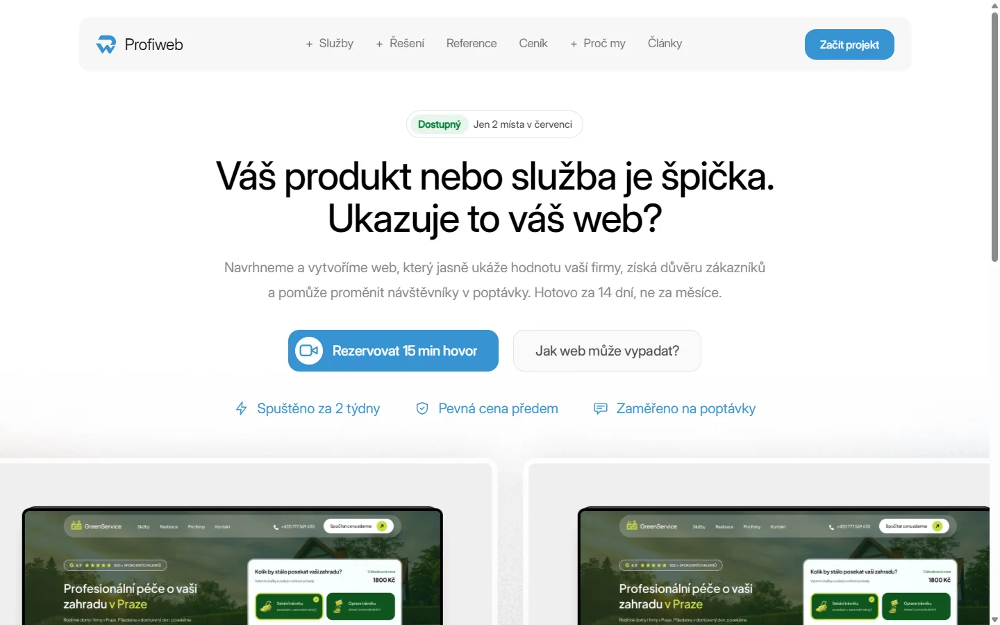
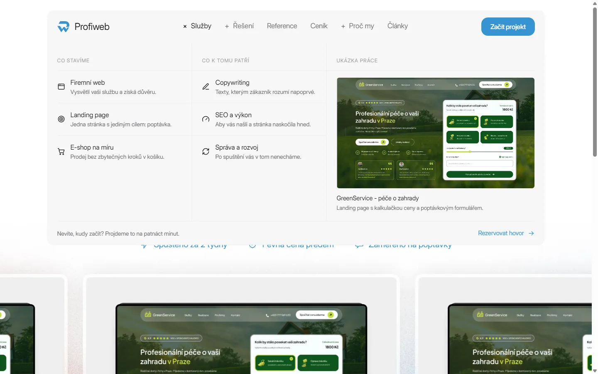
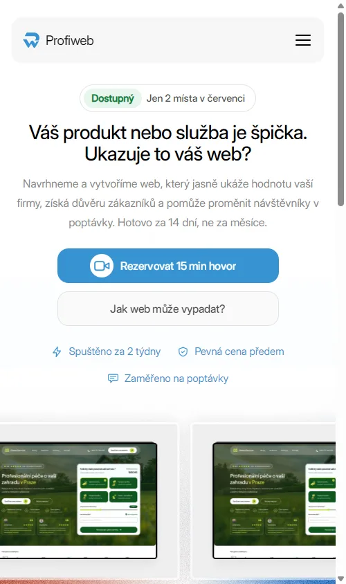
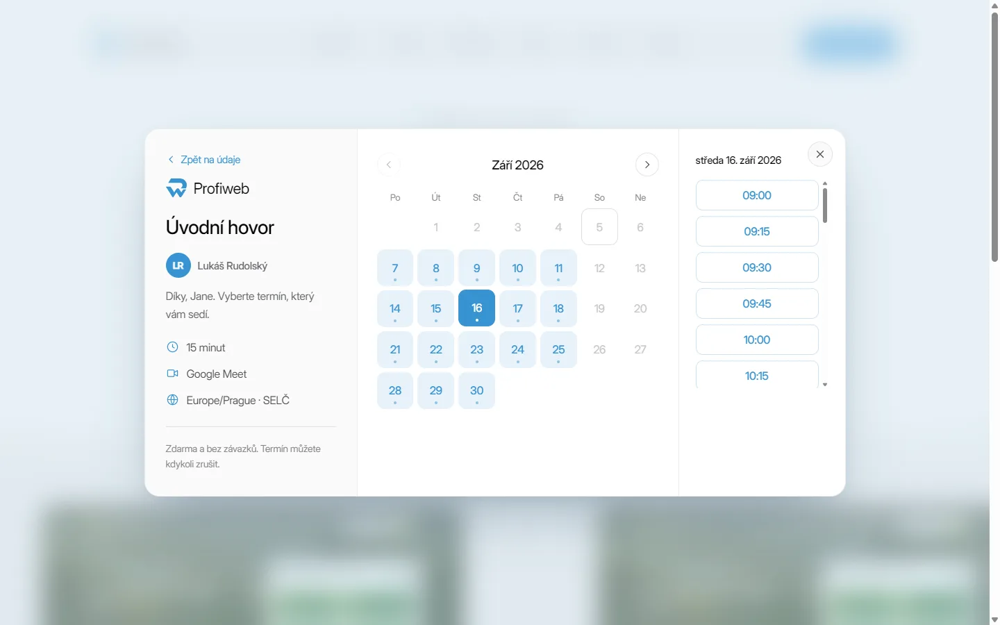
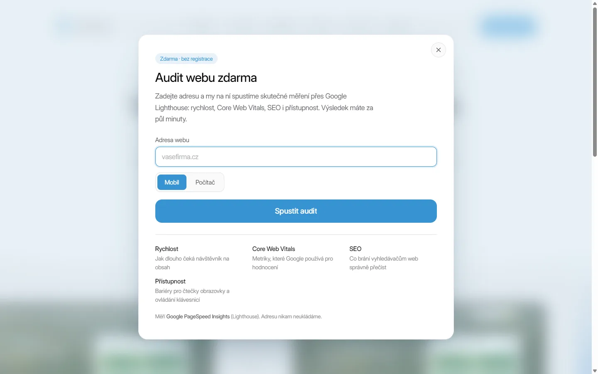
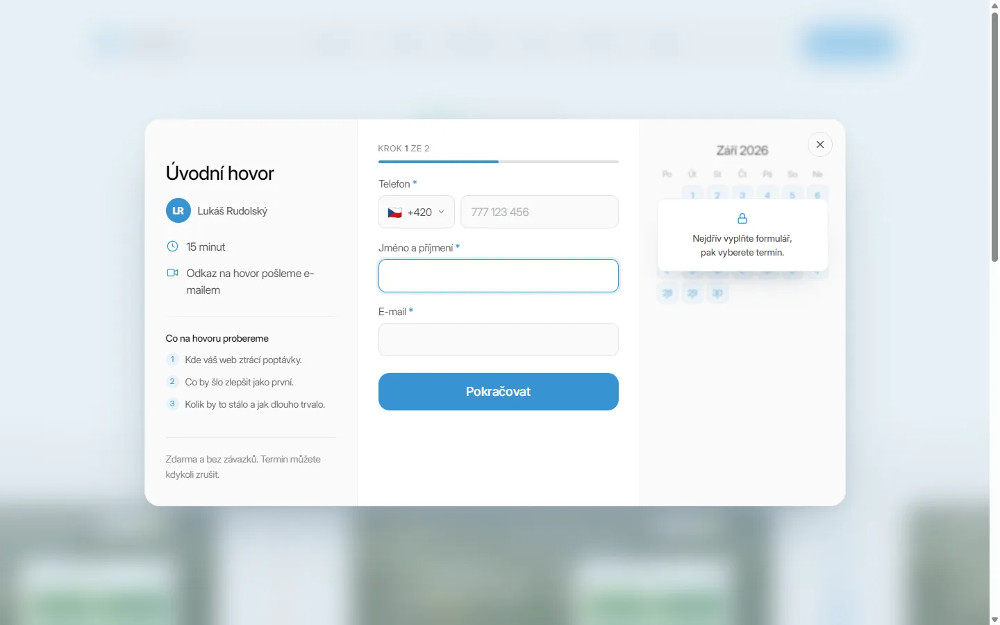
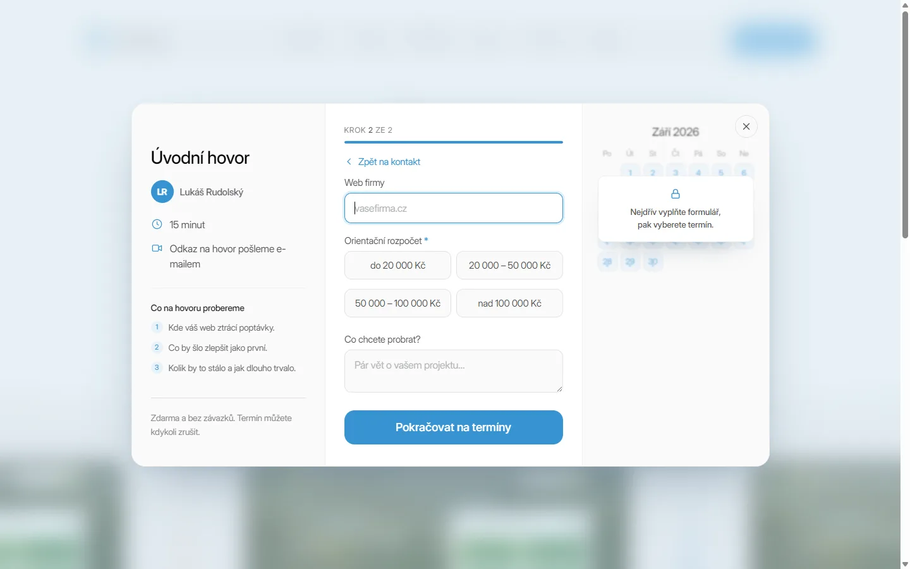
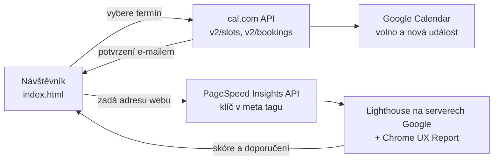
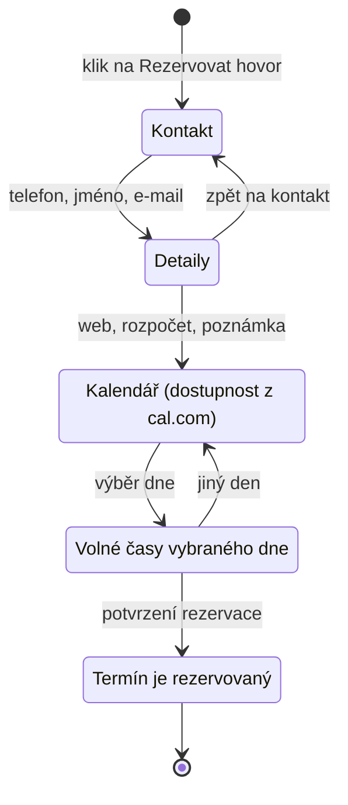
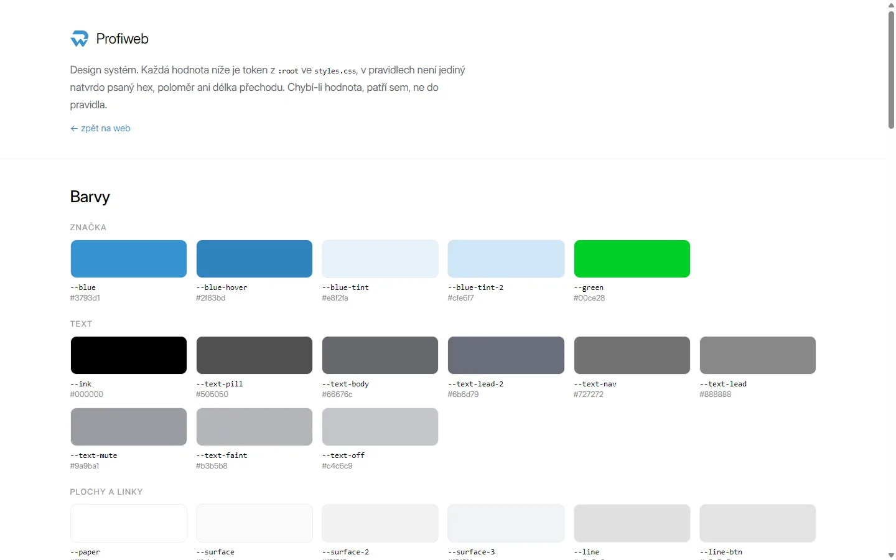

<div align="center">


<details>
<summary><b>Roztočit logo</b></summary>
<br>

</details>

# Profiweb.cz

### Weby, které přinesou poptávky do 14 dní

Statický marketingový web pro Profiweb, službu tvorby webů na míru.<br>
Čisté HTML, CSS a JavaScript. Žádný framework, žádný bundler, žádný build krok.


<br>


<br>
<br>



</div>

---

<div align="center">

**[Přehled](#-přehled)** ·
**[Náhledy](#-náhledy)** ·
**[Spuštění](#-jak-spustit-lokálně)** ·
**[Struktura](#-struktura-projektu)** ·
**[Jak to funguje](#-jak-to-funguje-uvnitř)** ·
**[Konfigurace](#-konfigurace-integrací)** ·
**[Design systém](#-design-systém)** ·
**[Přístupnost](#-přístupnost-a-klávesnice)** ·
**[Výkon](#-výkon)** ·
**[Nasazení](#-nasazení)** ·
**[Konvence](#-konvence-a-poznámky-k-vývoji)**

</div>

---

## 📋 Přehled

Jednostránkový web (`index.html`) postavený podle Figma návrhu. Cílem stránky
je získávat poptávky: návštěvník si přímo v modálu rezervuje úvodní hovor
nebo si nechá zdarma změřit svůj web.

| | |
| :-- | :-- |
| **Účel** | Marketingová landing page s rezervací hovoru a auditem webu |
| **Stack** | Vanilla HTML + CSS + JS, BEM konvence, bez preprocesoru |
| **Build** | Žádný. Soubory se nasazují přesně tak, jak leží v repozitáři |
| **Návrh** | Figma (frame 1440 px), fluidní `clamp()` škálování bez skoků |
| **Integrace** | cal.com (rezervace) a Google PageSpeed Insights (audit) |
| **Jazyk** | Čeština (`lang="cs"`) |
| **Hosting** | Jakýkoli statický: GitHub Pages, Netlify, Vercel, vlastní server |

---

## 🖼 Náhledy

<table>
  <tr>
    <td width="50%" valign="top">
      
      <p align="center"><b>Mega menu</b><br><sub>Rozbalovací panely v hlavičce. Pod 900 px se mění na accordion v drawer navigaci.</sub></p>
    </td>
    <td width="50%" valign="top">
      
      <p align="center"><b>Mobilní zobrazení</b><br><sub>Hero přeskládaný pod sebe, navigace schovaná v drawer menu.</sub></p>
    </td>
  </tr>
  <tr>
    <td width="50%" valign="top">
      
      <p align="center"><b>Rezervace hovoru</b><br><sub>Volné termíny čtené živě z cal.com, přepočtené do časové zóny návštěvníka.</sub></p>
    </td>
    <td width="50%" valign="top">
      
      <p align="center"><b>Audit webu zdarma</b><br><sub>Reálné měření přes Google Lighthouse: rychlost, Core Web Vitals, SEO, přístupnost.</sub></p>
    </td>
  </tr>
</table>

<details>
<summary><b>Rezervace krok za krokem</b></summary>

<br>

**1. Kontaktní údaje** – telefon s výběrem předvolby, jméno, e-mail. Kalendář
vpravo je zatím jen naznačený, aby bylo vidět, co přijde.



<br>

**2. Detaily projektu** – web firmy, orientační rozpočet a prostor na pár vět
o projektu.



<br>

**3. Výběr termínu** – kalendář s dostupností z cal.com, po výběru dne se
vpravo vypíšou volné časy.


</details>

---

## 🚀 Jak spustit lokálně

Web nepotřebuje build krok ani závislosti, stačí ho servírovat jako statické
soubory:

```bash
# libovolný statický server, například:
npx serve .
```

Pak otevřete `http://localhost:<port>/index.html`.

> [!TIP]
> Ve VS Code funguje i rozšíření **Live Server** spuštěné nad `index.html`.
> Otevření přes `file://` většinu stránky vykreslí, ale volání externích API
> (cal.com, PageSpeed) prohlížeč z `file://` původu zablokuje.

---

## 📁 Struktura projektu

```
.
├── index.html                  Živá stránka webu (jediná stránka)
├── assets/
│   ├── css/
│   │   └── styles.css          Všechny styly, tokeny v :root
│   ├── js/
│   │   ├── site.js             Navigace, mega menu, hero animace
│   │   ├── booking.js          Rezervační modal (cal.com API)
│   │   ├── audit.js            Audit webu (PageSpeed Insights API)
│   │   └── country-codes.js    Data telefonních předvoleb
│   ├── images/                 Optimalizované obrázky a ikony
│   │   └── source/             Zdrojové verze před optimalizací
│   └── fonts/                  Prázdné, fonty se zatím berou z Google Fonts
├── design-previews/            Náhledy komponent z Figmy (mimo živý web)
└── docs/                       Materiály pro toto README, mimo živý web
    ├── logo-3d.svg             Animované 3D logo v hlavičce (generované)
    ├── logo-3d-spin.svg        Jeho živější varianta na kliknutí
    ├── logo-3d.js              Generátor obou SVG
    └── screenshots/            Snímky obrazovky webu
```

Každá složka má vlastní `README.md` s podrobnostmi o svém obsahu.

### JavaScriptové moduly

Každý soubor je samostatné IIFE ve `strict` režimu, bez sdíleného globálního
stavu. Na stránku se napojuje přes `data-` atributy, takže se markup a chování
dají měnit nezávisle.

| Soubor | Co obsluhuje | Napojení v HTML |
| :-- | :-- | :-- |
| [site.js](assets/js/site.js) | Drawer navigace, mega menu, animace v hero sekci | `.nav-toggle`, `.nav-item__trigger` |
| [booking.js](assets/js/booking.js) | Rezervační modal: formulář, kalendář, časy, potvrzení | `[data-booking-open]`, `[data-booking-close]` |
| [audit.js](assets/js/audit.js) | Modal auditu, volání PageSpeed API, vykreslení reportu | `[data-audit-open]`, `<meta name="psi-api-key">` |
| [country-codes.js](assets/js/country-codes.js) | Data telefonních předvoleb pro pole v rezervaci | `[data-cc-search]` |

---

## 🔗 Jak to funguje uvnitř

Stránka je statická, takže veškerá logika běží v prohlížeči návštěvníka a
mluví přímo s cizími API. Nic se nikam neukládá na naší straně a v kódu není
žádné tajemství, které by nesmělo být veřejné.



Průchod rezervačním modálem jako stavy:



---

## 🔌 Konfigurace integrací

<details>
<summary><b>cal.com: rezervace úvodního hovoru</b></summary>

<br>

Nastavení je na začátku [assets/js/booking.js](assets/js/booking.js):

```js
var CAL = {
  username:      'lukas.rudolsky',   // cal.com/<username>/<slug>
  eventTypeSlug: '15min',
  timeZone:      'Europe/Prague'
};
```

Postup nastavení:

1. Na cal.com propojit **Apps → Google Calendar** (odtud se čtou obsazené
   termíny a zapisují nové události).
2. Vytvořit event type pro úvodní hovor a poznamenat si jeho slug.
3. Username a slug doplnit do `CAL` výše.

Použité endpointy nepotřebují žádný klíč, což je pro statický web podstatné:
cokoli v tomto souboru je čitelné pro každého návštěvníka. Když je `CAL`
prázdné, kalendář se přepne na lokální demo generátor, aby stránka fungovala
i bez napojení.

> [!WARNING]
> Endpointy pro sloty a rezervace mají v API každý **jinou verzi**. Poslání
> špatné verze skončí chybou 404 na routě, ne srozumitelnou chybou. Konstanty
> `V_SLOTS` a `V_BOOKINGS` v hlavičce souboru proto neměňte naslepo.

</details>

<details>
<summary><b>Google PageSpeed Insights: audit webu</b></summary>

<br>

Audit ([assets/js/audit.js](assets/js/audit.js)) vyžaduje API klíč vložený do
`index.html`:

```html
<meta name="psi-api-key" content="AIza…">
```

Klíč je zdarma (25 000 volání denně) na `console.cloud.google.com`:
**APIs & Services → Library → PageSpeed Insights API → Enable → Credentials →
Create API key**.

> [!IMPORTANT]
> Klíč omezte přes **HTTP referrer** na svoji doménu. Je veřejně viditelný
> ve zdroji stránky a právě referrer restrikce je to, co brání jeho zneužití.
> Bez klíče sdílejí požadavky společnou kvótu Google projektu, která bývá
> prakticky pořád vyčerpaná, a audit skončí chybou HTTP 429.

</details>

<details>
<summary><b>Stav: audit zatím nemá spouštěč na stránce</b></summary>

<br>

Modal auditu je v `index.html` hotový a `audit.js` ho umí otevřít kliknutím na
prvek s atributem `data-audit-open`, ale takový prvek na stránce zatím není.
Až bude sekce "Audit webu zdarma" na webu odkazovaná, stačí ho přidat:

```html
<button type="button" data-audit-open>Audit webu zdarma</button>
```

</details>

---

## 🎨 Design systém

Všechny barvy, poloměry, stíny a délky přechodů jsou tokeny v `:root` na
začátku [assets/css/styles.css](assets/css/styles.css). Pravidla pod nimi
tokeny jen spotřebovávají, natvrdo psaný hex do nich nepatří. Názvy jsou
sémantické (k čemu barva slouží), ne popisné, takže rebranding je změna
jediného bloku.

<div align="center">



<sub>Živý přehled všech tokenů: <a href="design-previews/styleguide.html"><code>design-previews/styleguide.html</code></a></sub>

</div>

Vybrané tokeny značky:

| Token | Hodnota | Použití |
| :-- | :-- | :-- |
| `--blue` | `#3793d1` | Primární barva značky, tlačítka, odkazy |
| `--blue-hover` | `#2f83bd` | Primární tlačítko při hoveru |
| `--blue-tint` | `#e8f2fa` | Vybraný den v kalendáři, odrážky |
| `--green` | `#00ce28` | Indikátor dostupnosti |
| `--ink` | `#000000` | Nadpisy |
| `--text-body` | `#66676c` | Běžný text |

**Responzivní model:** typografie, mezery i pás s laptopy škálují přes
`clamp()` tak, aby na šířce 1200 px seděly přesně na hodnoty z Figmy.
Nad 1200 px je render pixelově shodný s návrhem, pod ním se plynule zmenšuje.
Breakpointy jsou vyhrazené jen pro skutečné změny layoutu:

| Breakpoint | Co se mění |
| :-- | :-- |
| `1200 px` | Hero ztrácí pevnou výšku, dekorace se přesouvá pod text; níž už render není pixelově shodný s Figmou |
| `960 px` | Rezervační modal i audit se roztáhnou přes celou obrazovku |
| `900 px` | Navigace přechází do drawer menu, mega panely na accordion |
| `768 px` | Doladění hero: menší spodní odsazení, uvolněné zalomení titulku |

---

## ♿ Přístupnost a klávesnice

Modály nejsou jen vizuální vrstva, chovají se jako skutečné dialogy:

- **`Esc`** zavře otevřený modal i drawer navigaci.
- **`Tab`** se uvnitř otevřeného dialogu cyklí, ven z něj neuteče
  (focus trap v [booking.js](assets/js/booking.js) i [audit.js](assets/js/audit.js)).
- Po zavření se **fokus vrací** na prvek, ze kterého se dialog otevřel.
- Skryté kroky formuláře dostávají **`inert`**, takže vypadnou i z pořadí
  tabulátoru, nejen ze zorného pole.
- Dialogy mají `role="dialog"`, `aria-modal` a popisek přes `aria-labelledby`,
  rozbalovací navigace hlásí stav přes `aria-expanded`.
- Dekorativní obrázky mají prázdný `alt`, funkční mají popis.
- **`prefers-reduced-motion`** je respektován napříč stylopisem, animace se
  pro uživatele s tímto nastavením vypínají.

---

## ⚡ Výkon

- `preconnect` na Google Fonts, aby se spojení navazovalo souběžně s parsováním.
- Hero obrázek se `preload` + `fetchpriority="high"`, dekorace naopak
  `loading="lazy"` a `decoding="async"`.
- Obrázky jsou uložené ve WebP a JPG; needitované zdroje zůstávají mimo
  produkční cestu v [assets/images/source/](assets/images/source/).
- Žádný bundler znamená žádný runtime navíc: prohlížeč stahuje jeden
  stylopis a čtyři malé skripty, nic se nekompiluje ani nehydratuje.

---

## 🌍 Nasazení

Repozitář je připravený na jakýkoli statický hosting, nasazuje se obsah
kořenové složky tak, jak je:

| Hosting | Postup |
| :-- | :-- |
| **GitHub Pages** | Settings → Pages → Deploy from branch → `main` / `/ (root)` |
| **Netlify** | Nový web z repozitáře, build command prázdný, publish directory `.` |
| **Vercel** | Import repozitáře, framework preset *Other*, bez build kroku |
| **Vlastní server** | Nahrát obsah repozitáře do webrootu (FTP, rsync, cokoli) |

Po nasazení nezapomeňte na doménu omezit PageSpeed API klíč (viz
[Konfigurace integrací](#-konfigurace-integrací)).

---

## 🧭 Konvence a poznámky k vývoji

**Pravidla, která drží kód konzistentní**

- CSS třídy v **BEM** (`block__element--modifier`), žádný utility framework.
- Nová hodnota barvy, poloměru, stínu nebo délky přechodu patří **do `:root`**,
  ne do pravidla.
- Chování se na markup věší přes **`data-` atributy**, ne přes třídy použité
  pro vzhled.
- Hlavička každého JS souboru vysvětluje **proč** je věc řešená tak, jak je,
  ne jen co dělá. Při úpravě je dobré ji držet aktuální.

**Co je v repozitáři navíc**

- [design-previews/](design-previews/) obsahuje samostatné HTML náhledy
  komponent z Figma návrhu (`animace.html`, `ikony.html`, `tlacitko.html`,
  `styleguide.html` a další). Nejsou odkazované z `index.html` a nejsou potřeba
  pro provoz webu, slouží k izolovanému ladění. Sdílejí `styles.css` a
  `site.js`, takže zůstávají vizuálně konzistentní s webem.
- [assets/images/source/](assets/images/source/) drží needitované zdroje
  obrázků před kompresí. Na webu se nenačítají, jsou tam pro budoucí re-export.
- [assets/fonts/](assets/fonts/) je záměrně prázdná, připravená pro lokální
  hostování fontů (například kvůli GDPR nebo výkonu) místo Google Fonts CDN.

**Rozpracované**

- Sekce "Poznáváte se v tom?" má zatím zástupný obsah (tři shodné karty),
  čeká na finální texty.
- Audit webu nemá na stránce spouštěč, viz
  [Konfigurace integrací](#-konfigurace-integrací).
